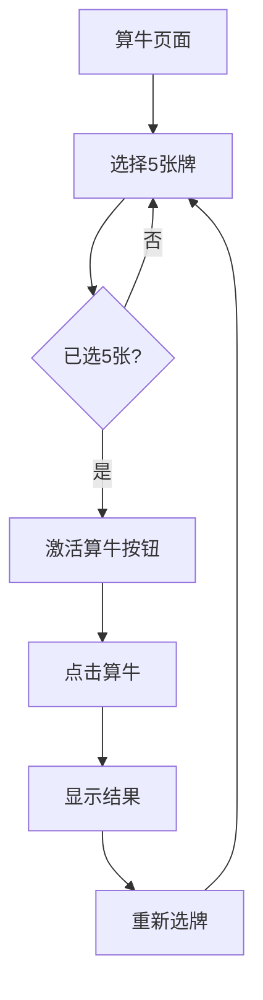

## 1. 产品概述
牛牛计算器是一款帮助玩家快速计算扑克牌牌型的工具应用。用户选择5张牌后，系统自动识别牌型（炸弹、五小、五花、牛牛等）并展示最优组合。专为牛牛游戏爱好者设计，提供便捷的牌型计算服务。

目标用户：牛牛游戏玩家、扑克牌爱好者，需要快速计算牌型的场景。

## 2. 核心功能

### 2.1 功能模块
牛牛计算器包含以下核心页面：
1. **算牛页面**：牌选择区域、算牛按钮、结果显示区域
2. **规则说明页面**：牌型规则介绍、计分说明

### 2.2 页面详情
| 页面名称 | 模块名称 | 功能描述 |
|---------|---------|---------|
| 算牛页面 | 牌选择区域 | 展示A、2-9、10/J/Q/K牌面，用户点击选择5张牌，已选牌高亮显示，支持取消选择 |
| 算牛页面 | 算牛按钮 | 用户选满5张牌后按钮变为可点击状态，点击后计算牌型 |
| 算牛页面 | 结果显示区域 | 展示计算结果：牌型名称（炸弹、五小、五花、牛牛等）和对应牌组合，未中奖时显示"无牛" |
| 规则说明页面 | 规则列表 | 展示各种牌型的定义和倍数说明 |

## 3. 核心流程
用户操作流程：
1. 用户进入算牛页面
2. 点击选择5张扑克牌
3. 系统自动检测已选牌数量，达到5张时激活"算牛"按钮
4. 用户点击"算牛"按钮
5. 系统计算牌型并展示结果
6. 用户可重新选择牌进行新一轮计算

## 4. 用户界面设计

### 4.1 设计风格
- **主色调**：深红色(#DC143C) + 金色(#FFD700)，营造激烈战斗氛围
- **辅助色**：深灰色(#2C2C2C)背景，突出扑克牌质感
- **按钮样式**：圆角矩形，悬停时有轻微放大效果
- **字体**：无衬线字体，主要文字16px，标题24px
- **布局风格**：卡片式布局，居中显示，突出核心功能
- **图标风格**：使用扑克牌相关emoji或简约线条图标

### 4.2 页面设计概览
| 页面名称 | 模块名称 | UI元素 |
|---------|---------|---------|
| 算牛页面 | 牌选择区域 | 深灰色背景上的红色边框卡片，每张牌为圆角矩形按钮，选中时金色边框高亮，悬停时有轻微阴影效果 |
| 算牛页面 | 算牛按钮 | 大圆角矩形按钮，深红色背景配金色文字，未激活时灰色半透明，激活后红色鲜艳，点击时有缩放动画 |
| 算牛页面 | 结果显示区域 | 金色边框的信息卡片，深红渐变背景，白色文字显示牌型和组合，重要信息使用金色高亮 |

### 4.3 响应式设计
- 桌面端：牌选择区域为网格布局，每行显示多张牌
- 移动端：牌选择区域自适应为更紧凑的布局，按钮大小适配触摸操作
- 支持横屏和竖屏模式，确保在各种移动设备上正常使用

### 4.4 动画效果
- 牌选择时：轻微的缩放动画和阴影变化
- 按钮激活：从灰色渐变到红色的颜色过渡
- 结果显示：淡入动画，重要信息逐个显示
- 重新选牌：平滑的界面重置过渡