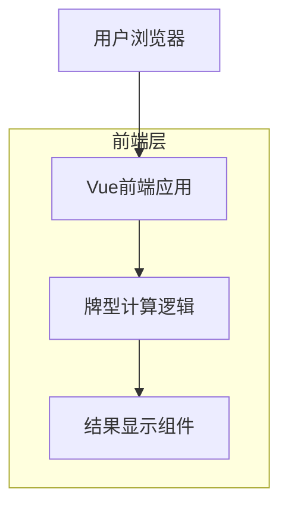
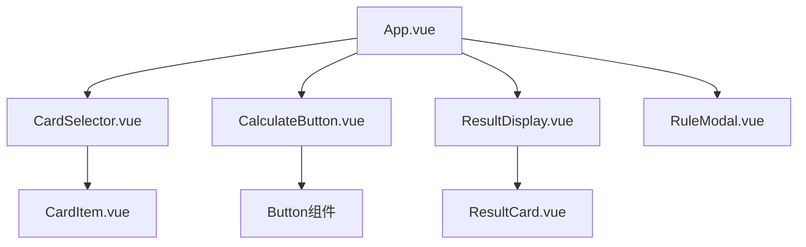

## 1. 架构设计



## 2. 技术描述

* **前端**: Vue\@3 + Vite + Element Plus UI库

* **初始化工具**: vite-init

* **后端**: 无（纯前端应用）

* **部署**: 静态网站托管（Vercel/Netlify）

## 3. 路由定义

| 路由     | 用途            |
| ------ | ------------- |
| /      | 算牛主页面，核心功能页面  |
| /rules | 规则说明页面，展示牌型规则 |

## 4. 核心算法逻辑

### 4.1 牌型定义

```typescript
interface Card {
  value: number; // A=1, 2-9=2-9, 10/J/Q/K=10
  display: string; // 'A', '2', '3', ..., '10', 'J', 'Q', 'K'
  suit?: string; // 花色（可选）
}

interface CardResult {
  type: string; // 牌型名称
  multiplier: number; // 倍数
  combination: Card[]; // 最优组合
  description: string; // 描述
}
```

### 4.2 牌型规则

* **炸弹**: 四张相同点数的牌

* **五小**: 五张牌点数总和≤10

* **五花**: 五张牌都是J/Q/K

* 四花: 五张牌中有四张是J/Q/K，外加一张10

* **牛牛**: 三张牌点数和为10的倍数，剩余两张牌点数和也为10的倍数

* **牛9-牛1**: 三张牌点数和为10的倍数，剩余两张牌点数和个位数为9-1

* **无牛**: 无法组成上述牌型

### 4.3 倍数说明

* **炸弹**: 10倍

* **五小**: 9倍

* **五花**: 8倍

* 四花: 7倍

* **牛牛**: 5倍

* **牛9**: 4倍

* 牛8: 3倍

* 牛7-牛1: 2倍

* **无牛**: 1倍

## 5. 组件架构



## 6. 状态管理

### 6.1 全局状态（Pinia）

```typescript
interface GameState {
  selectedCards: Card[];
  result: CardResult | null;
  isCalculating: boolean;
}
```

### 6.2 本地状态

* 牌选择状态：是否已选、悬停状态

* 计算状态：按钮激活状态、结果显示状态

* UI状态：模态框显示、动画状态

## 7. 响应式布局

### 7.1 断点设置

* 移动端: < 768px

* 平板端: 768px - 1024px

* 桌面端: > 1024px

### 7.2 布局适配

* 牌选择网格：移动端2列，平板3列，桌面4列

* 按钮大小：移动端48px高度，桌面40px高度

* 间距：移动端8px，桌面16px

## 8. 性能优化

* **组件懒加载**: 规则说明页面按需加载

* **计算缓存**: 相同牌组合结果缓存

* **动画优化**: 使用CSS transform而非position属性

* **图片优化**: 牌面图标使用SVG格式

## 9. 部署配置

### 9.1 Vercel配置

```json
{
  "builds": [
    {
      "src": "dist/**",
      "use": "@vercel/static"
    }
  ],
  "routes": [
    {
      "src": "/(.*)",
      "dest": "/index.html"
    }
  ]
}
```

### 9.2 构建命令

```bash
npm run build
npm run preview
```

